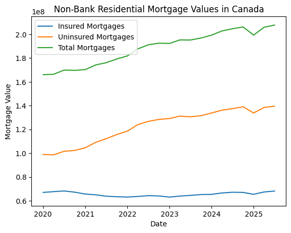
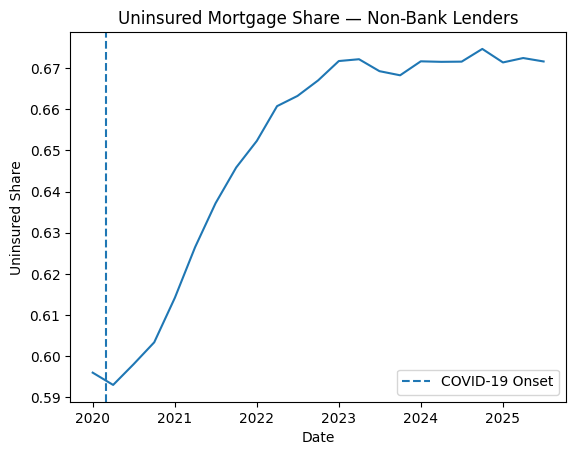
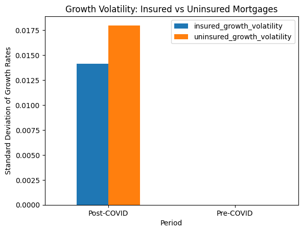

# Post-COVID Risk Shifts in Canada’s Non-Bank Residential Mortgage Market

## Project Overview

This project analyzes how the **risk profile of Canadian non-bank residential mortgages** has evolved over time, with a particular focus on **structural changes following COVID-19**. The analysis examines shifts between **insured and uninsured mortgages** to assess how credit risk exposure has changed for lenders.

---

## Business Question

**How has the risk profile of Canadian non-bank residential mortgages changed over time, particularly after COVID-19?**

### Why This Matters

- **Insured vs uninsured mortgages represent risk transfer**: insured mortgages shift default risk to insurers, while uninsured mortgages retain risk on lenders’ balance sheets.
- **COVID-19 represents a structural break** in housing markets, interest rates, and lending behavior.
- Understanding these shifts is critical for **risk management, financial stability, and policy analysis**.

---

## Data Preparation & Cleaning

The analysis uses publicly available Statistics Canada data focused on **non-bank residential lenders**.

### Key steps

- Loaded and parsed quarterly time-series mortgage data
- Converted mortgage values to numeric format
- Filtered data to **Canada and all non-bank lenders**
- Selected aggregate insured and uninsured mortgage series
- Handled missing and suppressed values

The final analytical dataset contains:

- Date
- Insured mortgage value
- Uninsured mortgage value
- Total mortgage value

---

## Risk Metric Construction

To move beyond raw trends, the following risk indicators were constructed:

- **Total Mortgages** = Insured + Uninsured
- **Uninsured Share** = Uninsured / Total Mortgages
- **Insured Share** = Insured / Total Mortgages

These metrics allow direct measurement of **risk concentration and lender exposure over time**.

---

## Time-Series Trend Analysis

### Chart 1 — Mortgage Value Trends (Insured vs Uninsured vs Total)

**What this shows**

- Total non-bank residential mortgage values increased steadily post-2020
- Uninsured mortgages grew faster than insured mortgages
- The widening gap indicates increasing lender-retained risk

---

## Risk Shift Analysis (Core Result)

### Chart 2 — Uninsured Mortgage Share Over Time

*A vertical reference line marks the onset of COVID-19 (March 2020).*

**Key insight**

- Post-COVID, the uninsured mortgage share rose from roughly **60% to over 65%**
- This indicates a **structural shift toward higher lender-held credit risk** within the non-bank mortgage sector

---

## Pre- vs Post-COVID Comparison

The dataset was divided into:

- **Pre-COVID:** before 2020
- **Post-COVID:** 2020 onward

### Comparisons performed

- Average growth rates for insured vs uninsured mortgages
- Average uninsured mortgage share

Results show that uninsured mortgage growth outpaced insured growth in the post-COVID period.

---

## Growth Volatility & Stability Analysis

### Chart 3 — Growth Volatility Comparison

**Interpretation**

- Uninsured mortgages exhibit **higher growth volatility** than insured mortgages post-COVID
- Higher volatility implies greater exposure to interest-rate shocks and economic downturns
- This reinforces the conclusion that lender risk has increased

---

## Key Findings & Implications

- Non-bank lenders increased exposure to **uninsured mortgages** following COVID-19
- Credit risk previously transferred to insurers is increasingly **retained on lenders’ balance sheets**
- This shift may amplify **systemic risk during periods of rising interest rates or economic stress**
- Results highlight the growing importance of non-bank lenders in Canada’s housing finance system

---

## Final Outputs

### Visuals

- Mortgage value trends (insured vs uninsured vs total)
- Uninsured mortgage share over time
- Growth volatility comparison

### Written Deliverables

- This README summary
- A fully reproducible Jupyter notebook (`analysis.ipynb`)
- Resume-ready analytical bullet aligned with findings

---

## Tools & Methods

- **Python** (Pandas, Matplotlib)
- Time-series analysis
- Risk metric construction
- Pre/post structural comparison
